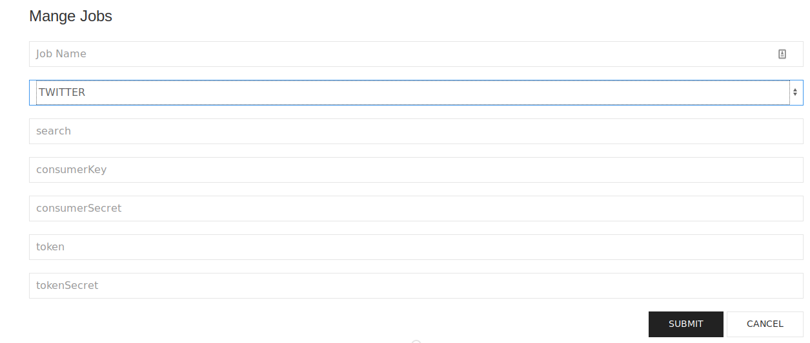

# Ingest service worker

A golang saleable job scheduler for long running ingestion jobs.
It is currently designed for for parsing news feed and twitter and storing them in elasticsearch and minio

Just some experimentation with creating ingest service.

currently only RSS/News feeds and twitter are supported.
Hopefully expand to cover:
- reddit
- weather
- stocks
- hackernews


## Architecture

Designed to be run in a containerised Infrastructure. needs connections to an ETCD, elasticsearch and Minio clusters.
ETCD is used for config and data sharing between the workers.

In this current implementation there is no concept of master-slave, all jobs are evenly distributed between them. Although the code to do this sharing is rather simplistic and assumes that all workers can process all jobs.

Since we are using ETCD when a new worker comes into the clusters the other workers detect and stop all jobs and will re-distribute the current list of jobs.



### Prerequisites

As noted above you need several components to get all the components to work they are an elasticsearch a S3 compatible server and a ETCD cluster.
Below is a list of Docker containers that I have used.

```
# Minio S3 compatible server that you can selfhost
docker run -p 9000:9000 --name minio1 -v /mnt/data:/data -v /mnt/config:/root/.minio minio/minio server /data

# etcd v3 Web UI
git clone https://github.com/soyking/e3w.git
cd e3w
docker-compose up

#elasticsearch
docker run -p 9200:9200 -p 9300:9300 -e "discovery.type=single-node" docker.elastic.co/elasticsearch/elasticsearch:6.3.2

```
### Installing

Clone this repo and get the golang requirements

```
go get github.com/coreos/etcd/clientv3
go get github.com/dghubble/go-twitter/twitter
go get github.com/dghubble/oauth1
go get github.com/sirupsen/logrus
```
Build the package ` go build `

## Adding new jobs

Adding additional jobs is hopefully a fairly simple process of creating a job that implements the following Job interface

```
type Job interface {
# function to set up a job. This is where the parmas get parsed into the required struct. The params variable is a stringified json
New(JobJson)
# When the job gets triggered a pointer the ETCD client, Logger the SettingStore and input and output channel
Init(*clientv3.Client, *logrus.Logger, *settings.SettingStore, *chan string, *chan Model)
# After the Job initialisation the the run function gets called inside a go fuc with a context and WaitGroup passed it. So that the jobs can be stopped
Run(context.Context, *sync.WaitGroup)
# returns how many things have been process
GetCount() int
# returns the params needed for this job
GetParams() *JobParams
}

#In a init method register this job with the job factory
func init() {
  RegisterJob("JOBNAME", pointer to job struct)
}


type JobJson struct {
  ID     string `json:"id"`
  Name   string `json:"name"`
  Type   string `json:"type"`
  Params string `json:"parmas"`
  Time   string `json:"time"`
}

type JobParams struct {
  Type   string   `json:"type"`
  Params []string `json:"params"`
}
```


## Deployment

Build the docker containers
```
docker-compose build
docker stack deploy -c docker-compose.yml ingest_service
```

## Running
There is a small webapp that runs that shows the current jobs with the ability to add or delete jobs


#### Adding new Job
Based on the list of parameters that get returned by the `GetParams()` job function the ui will display the required list. This means that so long as the list of parameters for you job is simple there will be no need for any UI coding


## License

This project is licensed under the MIT License - see the [LICENSE.md](LICENSE.md) file for details

